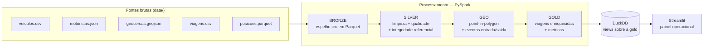

# Teste Big Core — Pipeline de Dados de Logística

Pipeline ETL que consolida cinco fontes brutas de uma operação de frota
(veículos, motoristas, geocercas, viagens e rastreamento GPS) em um lakehouse
em camadas, com enriquecimento geoespacial e um painel operacional.

Processamento em **PySpark**, arquitetura **medallion** (bronze → silver → gold),
**DuckDB** como camada de consulta do datalake local e **Streamlit** para a
visualização — tudo containerizado e executável com **um único comando**.

---

## Arquitetura



O fluxo é orquestrado por `src/pipeline.py`, que executa as etapas em ordem.
Cada camada é gravada como Parquet em `lakehouse/{bronze,silver,gold}` e o
DuckDB expõe a camada gold como VIEWs consultáveis via SQL.

---

## Stack e justificativas

| Camada | Tecnologia | Por quê |
|---|---|---|
| Processamento | **PySpark 3.5** (`local[*]`) | Engine obrigatória; roda o mesmo código de local a cluster |
| Geoespacial | **Shapely + STRtree** em `pandas_udf` | Point-in-polygon vetorizado e distribuído no Spark, sem jars externos. Para volumes muito maiores, a troca natural é Apache Sedona (ver [O que faria diferente](#o-que-eu-faria-diferente-com-mais-tempo)) |
| Armazenamento | **Parquet** particionado | Colunar, compacto, idempotente com `overwrite` |
| Datalake local | **DuckDB** | Simula o data warehouse do lakehouse: consulta os Parquets in-place, sem subir serviço externo |
| Visualização | **Streamlit + Plotly** | Painel rápido lendo direto da gold via DuckDB |
| Orquestração | `pipeline.py` + **Docker Compose** | Sobe tudo com um comando; DAG simples e determinístico |
| Qualidade | **pytest** + validações no pipeline | Testa as regras não triviais (CPF, point-in-polygon) |
| CI | **GitHub Actions** | Lint (pyflakes) + testes a cada push |

---

## Como rodar

### Com Docker (recomendado — um comando)

```bash
docker compose up --build
```

Isso executa o pipeline completo e, ao concluir, sobe o dashboard em
<http://localhost:8501>.

### Local (desenvolvimento)

Requer Python 3.10+ e uma JRE (Java 17).

```bash
pip install -r requirements.txt
cp .env.example .env          # ajuste os caminhos se necessario
python -m src.pipeline        # roda o ETL
streamlit run dashboard/app.py
```

Atalhos no `Makefile`: `make up`, `make pipeline`, `make dashboard`, `make test`.

---

## Variáveis de ambiente

Configuráveis via `.env` ou variáveis de ambiente (ver `.env.example`). Nada é
hardcoded no código.

| Variável | Padrão | Descrição |
|---|---|---|
| `DATA_DIR` | `data` | Diretório das fontes brutas |
| `LAKEHOUSE_DIR` | `lakehouse` | Raiz das camadas bronze/silver/gold |
| `DUCKDB_PATH` | `lakehouse/warehouse.duckdb` | Catálogo DuckDB servido ao dashboard |
| `SPARK_MASTER` | `local[*]` | Master do Spark |
| `SPARK_DRIVER_MEMORY` | `2g` | Memória do driver |
| `BR_LAT_MIN/MAX`, `BR_LON_MIN/MAX` | bbox do Brasil | Filtro de coordenadas válidas |
| `VELOCIDADE_MAX_KMH` | `140` | Teto físico de velocidade para caminhão |
| `DASHBOARD_PORT` | `8501` | Porta do Streamlit |

---

## Tratamento de dados sujos

As inconsistências propositais são tratadas na camada **silver**, com contagens
logadas para rastreabilidade:

| Fonte | Problema | Tratamento |
|---|---|---|
| veículos | placas fora do padrão Mercosul | flag `placa_valida` |
| motoristas | 4 duplicatas, nomes vazios | dedup determinística (preferindo registro completo), nome vazio → nulo |
| motoristas | CPF inválido | flag `cpf_valido` (dígitos verificadores) |
| viagens | `data_inicio` nula | descartadas (métricas temporais dependem dela) |
| viagens | `distancia_km` negativa | anulada |
| viagens | `veiculo_id`/`motorista_id` órfãos | **integridade referencial**: removidas (3000 → 2892) |
| posições | lat/lon zeradas ou fora do Brasil | descartadas (bounding box) |
| posições | velocidade negativa/absurda | descartadas (0–140 km/h) |
| posições | `timestamp` nulo | descartadas |
| todas | duplicatas por PK | `dropDuplicates` na chave |

Padronizações: datas convertidas para `date`/`timestamp`, strings com `trim`,
categóricos (`status`, `tipo`, `categoria_cnh`) normalizados.

---

## Modelagem (camada gold)

Fato central **`viagens_enriquecidas`** (particionada por `mes_referencia`):
viagem + veículo + motorista + geocercas de origem/destino + métricas derivadas
(duração, velocidade média, atraso).

Métricas materializadas:

- `viagens_por_mes_status` — viagens por mês e status
- `tempo_medio_por_rota` — tempo médio por rota (origem → destino)
- `velocidade_media_por_viagem`
- `taxa_atraso_por_mes`
- `top10_motoristas` — por viagens concluídas
- `utilizacao_frota_por_mes` — veículos ativos com viagem / total de ativos
- `tempo_medio_parado_por_tipo` — tempo parado em geocercas por tipo

### Enriquecimento geoespacial

Cada posição GPS é classificada por point-in-polygon como `em_geocerca`
(identificando qual) ou `em_rota`. A detecção de entrada/saída agrupa pings
consecutivos numa mesma geocerca (técnica de *islands* com window function),
produzindo `eventos_geocerca` com entrada, saída e tempo parado por visita.

---

## Idempotência e resiliência

- Todas as escritas usam `mode("overwrite")` + `partitionOverwriteMode=dynamic`;
  reexecutar o pipeline **não duplica** dados (validado: contagens estáveis).
- As VIEWs do DuckDB são recriadas com `CREATE OR REPLACE`.
- Logging estruturado em cada etapa, com tempos e contagens.
- Etapas isoladas por camada, facilitando reprocessamento parcial.

---

## Estrutura de pastas

```
.
├── docker-compose.yml        # pipeline + dashboard (um comando)
├── Dockerfile
├── Makefile
├── requirements.txt
├── .env.example
├── data/                     # fontes brutas
├── docs/dados.md             # dicionário de dados
├── src/
│   ├── config.py             # config via env vars
│   ├── spark_session.py
│   ├── logging_conf.py
│   ├── quality.py            # validadores (CPF, placa)
│   ├── bronze.py             # extração
│   ├── silver.py             # limpeza + integridade
│   ├── geo.py                # point-in-polygon + eventos
│   ├── gold.py               # modelo + métricas
│   ├── lakehouse.py          # views DuckDB
│   └── pipeline.py           # orquestrador
├── dashboard/app.py          # Streamlit
├── tests/                    # pytest
└── .github/workflows/ci.yml  # lint + testes
```

---

## O que eu faria diferente com mais tempo

- **Apache Sedona** no lugar do Shapely+UDF para o join espacial, quando o
  volume de posições justificar processamento geoespacial distribuído nativo.
- **Delta Lake** para versionamento (time travel) e `MERGE` incremental, em vez
  de overwrite total.
- **Great Expectations / Soda** para data quality declarativa, com quarentena
  de registros rejeitados em vez de descarte.
- **Orquestrador** (Airflow/Dagster) com agendamento e retries por etapa.
- A amostragem GPS dentro das geocercas é esparsa (poucos pings por visita),
  então o "tempo parado" fica subestimado; com telemetria mais densa a métrica
  ganha significado — ou poderia ser inferida interpolando a trajetória.
- Testes de integração ponta-a-ponta e checks de qualidade como *gates* que
  falham o pipeline ao violar limiares.
