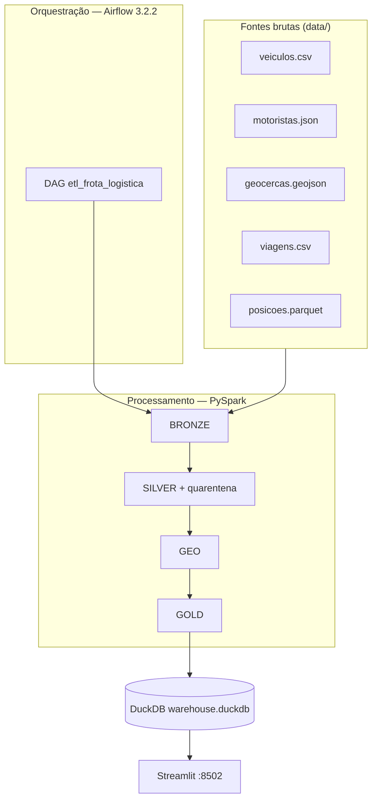

# Teste Big Core — Pipeline de Dados de Logística

Pipeline ETL/ELT que consolida cinco fontes brutas de uma operação de frota
(veículos, motoristas, geocercas, viagens e rastreamento GPS) em um lakehouse
medallion, com enriquecimento geoespacial, orquestração via **Apache Airflow
3.2.2** e painel operacional em **Streamlit**.

| Camada | Tecnologia |
|--------|------------|
| Processamento | PySpark 3.5 (`local[*]`) |
| Orquestração | Airflow 3.2.2 (CeleryExecutor) |
| Armazenamento | Parquet (bronze / silver / gold) |
| Consulta | DuckDB (views sobre Parquet) |
| Visualização | Streamlit + Plotly |
| Containerização | Docker Compose |

---

## Arquitetura



O **Airflow** dispara uma task por etapa (`bronze` → `silver` → `geo` →
`gold` → `lakehouse` → `validar_gold`), com retries e timeouts. O serviço
`etl-bootstrap` dispara a DAG na primeira subida e aguarda conclusão antes
de liberar o dashboard — mantendo a experiência de **um comando**.

---

## Formato de saída

Todo o lakehouse é materializado em **Apache Parquet** (colunar, compacto,
schema estável). O DuckDB **não duplica** dados: registra VIEWs SQL que leem
os Parquets in-place.

```
lakehouse/
├── bronze/                 # espelho tipado das fontes
│   ├── veiculos/
│   ├── motoristas/
│   ├── geocercas/          # geometry_wkt (GeoJSON → WKT)
│   ├── viagens/
│   └── posicoes/
├── silver/                 # dados confiáveis + geo
│   ├── veiculos/
│   ├── motoristas/
│   ├── geocercas/
│   ├── viagens/
│   ├── posicoes/
│   ├── posicoes_geo/       # classificacao em_geocerca / em_rota
│   └── eventos_geocerca/   # visitas (entrada, saida, duracao)
├── gold/                   # modelo analitico
│   ├── viagens_enriquecidas/   # particionado por mes_referencia
│   ├── viagens_por_mes_status/
│   ├── tempo_medio_por_rota/
│   ├── velocidade_media_por_viagem/
│   ├── taxa_atraso_por_mes/
│   ├── top10_motoristas/
│   ├── utilizacao_frota_por_mes/
│   └── tempo_medio_parado_por_tipo/
├── rejeitados/             # quarentena auditavel
│   ├── viagens/
│   └── posicoes/
└── warehouse.duckdb        # catalogo SQL (13 views)
```

Escritas em `mode("overwrite")` + `partitionOverwriteMode=dynamic` — reexecutar
o pipeline **não duplica** registros.

---

## Como rodar

### Pré-requisitos

- Docker Desktop 4.x+ (Compose v2.14+)
- **4 GB RAM** livres para o stack Airflow (Postgres + Redis + Celery)
- Java **17** se rodar PySpark fora do Docker (não use Java 21 — quebra o
  `pandas_udf` geoespacial por incompatibilidade Arrow)

### Um comando (recomendado)

```bash
cd teste-big-core
cp .env.example .env    # primeira vez
docker compose up --build
```

| Serviço | URL | Credenciais |
|---------|-----|-------------|
| Airflow UI | http://localhost:8080 | `airflow` / `airflow` |
| Dashboard | http://localhost:8502 | — |

O fluxo automático:

1. Sobe Postgres, Redis e componentes Airflow
2. `etl-bootstrap` dispara a DAG `etl_frota_logistica` e aguarda `success`
3. Dashboard sobe com dados prontos na gold

### Comandos úteis

```bash
make up                  # equivalente a docker compose up --build
make down                # para todos os containers
make airflow-trigger     # reprocessa ETL via Airflow
make airflow-logs        # logs worker + scheduler
make flower              # monitor Celery (porta 5555)
make test                # pytest local
make pipeline            # ETL direto, sem Airflow
make pipeline-docker     # ETL via container (profile legacy)
```

### Pipeline direto (sem Airflow)

```bash
python -m src.pipeline                    # completo
python -m src.pipeline --stage bronze     # uma etapa
python -m src.pipeline --from-stage geo   # geo → lakehouse
```

---

## Etapas do pipeline (detalhamento)

### 1. Bronze — ingestão fiel (`src/bronze.py`)

**Objetivo:** materializar as cinco fontes em Parquet sem alterar semântica.
Bronze é espelho cru com formato padronizado.

| Fonte | Formato entrada | Tratamento na ingestão |
|-------|-----------------|------------------------|
| veiculos | CSV | leitura permissiva, schema string |
| motoristas | JSON | multiline |
| geocercas | GeoJSON | polígono → coluna `geometry_wkt` (coordenadas intactas) |
| viagens | CSV | leitura permissiva |
| posicoes | Parquet | leitura nativa |

**Decisão:** GeoJSON vira WKT tabular para viabilizar join e UDF no Spark sem
dependência de jars geoespaciais. O conteúdo geométrico não é modificado.

**Saída:** `lakehouse/bronze/{dataset}/*.parquet`

---

### 2. Silver — confiabilidade e integridade (`src/silver.py`)

**Objetivo:** transformar dados brutos em tabelas **confiáveis** para analytics.
Aqui mora a maior parte da engenharia de qualidade.

#### Veículos
- Dedup por `veiculo_id`
- Padronização: `placa` upper, `status` lower
- Flag `placa_valida` (regex Mercosul)
- Cast de tipos numéricos e datas

#### Motoristas
- Dedup determinística por `motorista_id` (prefere registro com nome preenchido)
- Flag `cpf_valido` (dígitos verificadores mod 11)
- Normalização de `status`, `categoria_cnh`

#### Viagens
- Cast de timestamps e inteiros
- **Integridade referencial:** rejeita viagens com `data_inicio` nula,
  `veiculo_id` ou `motorista_id` inexistentes
- `distancia_km` negativa → anulada (não rejeita a viagem)

#### Posições GPS
- Dedup por `posicao_id`
- Rejeita: timestamp nulo, coordenada (0,0), fora do bounding box Brasil,
  velocidade fora de 0–140 km/h, viagem inexistente na silver

#### Quarentena
Registros rejeitados **não são apagados** — vão para
`lakehouse/rejeitados/` com `motivo_rejeicao`, expostos no DuckDB e no painel.

**Contagens típicas:** 3.000 → 2.892 viagens | 56.182 → 53.908 posições

**Saída:** `lakehouse/silver/{dataset}/*.parquet` + `lakehouse/rejeitados/`

---

### 3. Geo — enriquecimento geoespacial (`src/geo.py`)

**Objetivo:** responder, para cada posição GPS, se o veículo está dentro de
alguma geocerca e detectar visitas (entrada/saída).

#### Point-in-polygon
- ~38 polígonos cabem em memória → broadcast para executores Spark
- Indexação **STRtree** (Shapely) + `pandas_udf` vetorizado
- Predicado `within` (Point dentro de Polygon)
- Classificação: `em_geocerca` (com `geocerca_id` e `tipo`) ou `em_rota`

#### Eventos de visita
- Window function por `viagem_id` ordenada por `timestamp`
- Agrupa pings consecutivos na mesma geocerca (*islands*)
- Calcula `entrada_ts`, `saida_ts`, `duracao_segundos`, `qtd_pontos`

**Resultado validado:** 143 posições em geocerca, 0 falsos positivos/negativos
vs recomputação Shapely independente.

**Saída:** `silver/posicoes_geo/`, `silver/eventos_geocerca/`

---

### 4. Gold — modelo analítico (`src/gold.py`)

**Objetivo:** materializar o fato central e as métricas de negócio pedidas.

#### Fato `viagens_enriquecidas`
Join viagem + veículo + motorista + geocercas origem/destino + agregados GPS
(velocidade média/máxima, qtd posições). Campos derivados:
- `mes_referencia` (de `data_inicio`)
- `duracao_horas`, `atraso_horas`, `flag_atrasada`

Particionado por `mes_referencia`.

#### Métricas (7 tabelas)
1. Viagens por mês e status
2. Tempo médio por rota (origem → destino)
3. Velocidade média por viagem
4. Taxa de atraso por mês (`status == 'atrasada'`)
5. Top 10 motoristas (viagens concluídas)
6. Utilização da frota por mês
7. Tempo médio parado por tipo de geocerca

**Saída:** `lakehouse/gold/{tabela}/`

---

### 5. Lakehouse — camada de serviço (`src/lakehouse.py`)

**Objetivo:** simular o data warehouse do lakehouse sem subir serviço externo.

DuckDB registra VIEWs sobre Parquet:
- 8 tabelas gold
- `posicoes_geo`, `eventos_geocerca`, `geocercas` (silver)
- `rejeitados_viagens`, `rejeitados_posicoes`

O dashboard consulta essas views — **zero reprocessamento** no Streamlit.

**Saída:** `lakehouse/warehouse.duckdb`

---

### 6. Validação pós-ETL (task Airflow `validar_gold`)

Smoke test automatizado:
- DuckDB existe
- `viagens_enriquecidas` ≥ 2.800 linhas
- Views críticas presentes (`geocercas`, `posicoes_geo`, `viagens_enriquecidas`)

---

## Airflow — DAG `etl_frota_logistica`

Arquivo: `dags/etl_frota_logistica.py`

```
medallion.bronze → medallion.silver → medallion.geo → medallion.gold
                                                        ↓
                                                   lakehouse → validar_gold
```

| Configuração | Valor |
|--------------|-------|
| Executor | CeleryExecutor (worker separado do scheduler) |
| Retries | 2 (delay 2 min) |
| Timeouts | 10–45 min por task |
| Agendamento | Manual (`schedule=None`); ativar cron no Airflow se quiser |
| Idempotência | Cada task roda `python -m src.pipeline --stage X` |

Stack Airflow: Postgres 16 (metadados), Redis 7.2 (broker), api-server,
scheduler, dag-processor, worker, triggerer.

---

## Dashboard (`dashboard/app.py`)

Painel operacional que lê **somente** a gold via DuckDB:

- KPIs: viagens, concluídas, taxa de atraso, tempo parado
- Gráficos por mês/status, top motoristas, utilização frota
- **Mapa geoespacial:** polígonos das 38 geocercas (cadastro GeoJSON/WKT) +
  pings GPS classificados — prova visual do point-in-polygon
- Seção quarentena: rejeitados por motivo

---

## Observações sobre os dados (fidelidade)

Resultados validados por recomputação independente — **não foram ajustados**:

| Fenômeno | Explicação |
|----------|------------|
| Um único mês (2026-04) | Todas as viagens iniciam nesse período |
| Tempo parado ≈ 0 | 1 ping GPS por passagem em geocerca — sem permanência mensurável |
| Utilização 100% | 123/123 veículos ativos com viagem no período |
| 143 pings em geocerca | Cercas ~1 km, ~19 pings/viagem em rotas longas |
| Trajetórias “retas” no mapa | Base sintética com interpolação linear entre origem/destino |
| Taxa atraso 10,75% | Usa `status == 'atrasada'`, não comparação de datas (48% se usar datas) |

Origem/destino na gold vêm do **cadastro** (`viagens.csv`), não do GPS.

---

## Variáveis de ambiente

Ver `.env.example`. Principais:

| Variável | Padrão | Descrição |
|----------|--------|-----------|
| `DATA_DIR` | `/app/data` | Fontes brutas |
| `LAKEHOUSE_DIR` | `/app/lakehouse` | Raiz medallion |
| `DUCKDB_PATH` | `lakehouse/warehouse.duckdb` | Catálogo SQL |
| `SPARK_DRIVER_MEMORY` | `2g` | Memória driver Spark |
| `BR_LAT/LON_*` | bbox Brasil | Filtro coordenadas |
| `VELOCIDADE_MAX_KMH` | `140` | Teto velocidade |
| `DASHBOARD_PORT` | `8502` | Porta Streamlit |
| `AIRFLOW_PORT` | `8080` | Porta Airflow UI |
| `FERNET_KEY` | (ver .env.example) | Criptografia Airflow |

---

## Estrutura de pastas

```
.
├── docker-compose.yml       # Airflow + bootstrap ETL + dashboard
├── Dockerfile               # pipeline / dashboard (PySpark + Java 17)
├── Dockerfile.airflow       # Airflow 3.2.2 + deps ETL
├── Makefile
├── requirements.txt         # deps completas (dev + dashboard)
├── requirements-etl.txt     # deps ETL na imagem Airflow
├── .env.example
├── dags/
│   └── etl_frota_logistica.py
├── scripts/
│   └── airflow_bootstrap.py # trigger + wait (Airflow 3 sem --wait)
├── config/airflow/          # config gerada localmente (gitignore)
├── plugins/
├── data/                    # fontes brutas
├── docs/dados.md            # dicionário de dados
├── src/
│   ├── config.py
│   ├── spark_session.py
│   ├── logging_conf.py
│   ├── quality.py
│   ├── bronze.py
│   ├── silver.py
│   ├── geo.py
│   ├── gold.py
│   ├── lakehouse.py
│   └── pipeline.py          # orquestrador CLI (--stage)
├── dashboard/app.py
├── tests/
└── .github/workflows/ci.yml
```

---

## CI

GitHub Actions (`ci.yml`): **ruff** (pyflakes) + **pytest** a cada push.
O ETL completo não roda no CI (requer Java 17 + Spark); validação local via
Docker.

---

## O que faria diferente com mais tempo

- **Apache Sedona** para spatial join distribuído nativo em volumes maiores
- **Delta Lake** com MERGE incremental e time travel
- **Great Expectations** como gate de qualidade bloqueante no Airflow
- Agendamento `@daily` com backfill por `mes_referencia`
- CI rodando `docker compose up` headless como teste de integração
- Job de enriquecimento inferindo origem/destino real via GPS (hoje vem do cadastro)
