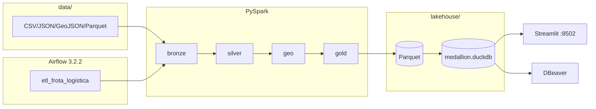

# Teste Big Core — Pipeline de Dados de Logística

Solução completa para o **teste técnico de Engenheiro de Dados**: pipeline ETL/ELT que consolida cinco fontes brutas de uma operação de frota (veículos, motoristas, geocercas, viagens e rastreamento GPS) em um **lakehouse medallion**, com enriquecimento geoespacial, orquestração via **Apache Airflow 3.2.2** e painel operacional em **Streamlit**.

> Diagrama de arquitetura: abra [`docs/arquitetura.drawio`](docs/arquitetura.drawio) no [draw.io](https://app.diagrams.net/) (Arquivo → Abrir).

---

## Stack

| Camada | Tecnologia | Papel |
|--------|------------|-------|
| Linguagem | Python 3.11 | Código do pipeline, dashboard, testes |
| Processamento | **PySpark 3.5** (`local[*]`) | Engine principal (obrigatório no enunciado) |
| Geoespacial | Shapely + `pandas_udf` | Point-in-polygon vetorizado no Spark |
| Orquestração | **Airflow 3.2.2** (CeleryExecutor) | DAG com uma task por etapa |
| Armazenamento | **Apache Parquet** | Bronze / Silver / Gold / Rejeitados |
| Consulta | **DuckDB** | Views SQL sobre Parquet (`medallion.duckdb`) |
| Visualização | Streamlit + Plotly | Dashboard operacional `:8502` |
| Containerização | Docker Compose | Um comando sobe tudo |
| CI | GitHub Actions | Ruff + pytest |
| Exploração SQL | DBeaver | Schemas medallion no DuckDB |

---

## Início rápido (do zero)

### 1. Pré-requisitos

| Ferramenta | Versão mínima | Observação |
|------------|---------------|------------|
| **Git** | qualquer recente | Para clonar o repositório |
| **Docker Desktop** | 4.x+ | Compose v2.14+. **Obrigatório** para subir o projeto |
| **RAM livre** | **4 GB+** | Stack Airflow (Postgres + Redis + Celery + Spark) |
| Java 17 | opcional | Só se rodar PySpark **fora** do Docker (não use Java 21) |

### 2. Clonar e configurar

```bash
git clone https://github.com/ruanhanani/teste-big-core.git
cd teste-big-core
```

**Windows (PowerShell):**

```powershell
copy .env.example .env
```

**Linux / macOS:**

```bash
cp .env.example .env
```

O arquivo `.env` já traz valores padrão para Docker. Não é necessário editar na primeira execução.

### 3. Subir tudo (um comando)

```bash
docker compose up --build
```

Aguarde até o serviço `dashboard` subir. Na primeira execução o fluxo é:

1. **Postgres + Redis** — infraestrutura do Airflow
2. **airflow-init** — migração do banco e usuário `airflow` / `airflow`
3. **Componentes Airflow** — scheduler, worker, api-server, dag-processor, triggerer
4. **etl-bootstrap** — dispara a DAG `etl_frota_logistica` e aguarda `success`
5. **dashboard** — Streamlit com dados prontos

### 4. Acessar

| Serviço | URL | Credenciais |
|---------|-----|-------------|
| **Dashboard** | http://localhost:8502 | — |
| **Airflow UI** | http://localhost:8080 | `airflow` / `airflow` |
| **Flower** (opcional) | http://localhost:5555 | `make flower` |

### 5. Validar saída

Com o lakehouse gerado (após o ETL):

```bash
docker compose exec airflow-worker python /app/scripts/validate_lakehouse.py
docker compose exec airflow-worker python /app/scripts/validate_dashboard.py
```

Saída esperada: contagens ~3.000 bronze viagens, ~2.892 gold, 143 pings em geocerca, 10 top motoristas.

---

## Arquitetura



Diagrama visual completo (camadas, componentes Airflow, fluxos): **[`docs/arquitetura.drawio`](docs/arquitetura.drawio)**.

---

## O que cada componente faz

### Pipeline PySpark (`src/`)

| Etapa | Módulo | Entrada | Saída | O que faz |
|-------|--------|---------|-------|-----------|
| **bronze** | `bronze.py` | `data/` (5 fontes) | `lakehouse/bronze/` | Ingestão fiel — espelho cru em Parquet |
| **silver** | `silver.py` | bronze | `lakehouse/silver/` + `rejeitados/` | Limpeza, dedup, validação CPF/placa, integridade referencial, quarentena |
| **geo** | `geo.py` | silver posições + geocercas | `silver/posicoes_geo`, `eventos_geocerca` | Point-in-polygon, classificação `em_geocerca` / `em_rota`, eventos entrada/saída |
| **gold** | `gold.py` | silver + geo | `lakehouse/gold/` (8 tabelas) | Viagens enriquecidas + 7 métricas do enunciado |
| **lakehouse** | `lakehouse.py` | todos os Parquets | `medallion.duckdb` | Views DuckDB por schema (bronze/silver/gold/rejeitados) |

CLI: `python -m src.pipeline` ou `python -m src.pipeline --stage bronze`.

### Airflow — infraestrutura

| Serviço | Função |
|---------|--------|
| **postgres** | Banco de metadados do Airflow (DAGs, runs, tasks, conexões) |
| **redis** | Message broker do CeleryExecutor |
| **airflow-init** | Migração do schema, cria usuário admin, ajusta permissões do `lakehouse/` |
| **airflow-apiserver** | API REST + UI web na porta **8080** |
| **airflow-scheduler** | Agenda tasks conforme dependências da DAG |
| **airflow-dag-processor** | Carrega e parseia arquivos em `dags/` |
| **airflow-worker** | Worker Celery que **executa** as tasks (PySpark roda aqui) |
| **airflow-triggerer** | Suporte a operadores deferrable |
| **etl-bootstrap** | Script one-shot: dispara DAG e faz poll até `success` (substitui `pipeline` manual) |
| **dashboard** | Streamlit — sobe **após** o bootstrap com dados prontos |

### Airflow — DAG `etl_frota_logistica`

Arquivo: `dags/etl_frota_logistica.py`

```
medallion.bronze → medallion.silver → medallion.geo → medallion.gold
                                                        ↓
                                                   lakehouse → validar_gold
```

| Task | Comando | Timeout | O que valida / produz |
|------|---------|---------|------------------------|
| `medallion.bronze` | `pipeline --stage bronze` | 30 min | 5 datasets em Parquet |
| `medallion.silver` | `pipeline --stage silver` | 30 min | Dados limpos + quarentena |
| `medallion.geo` | `pipeline --stage geo` | 45 min | `posicoes_geo`, `eventos_geocerca` |
| `medallion.gold` | `pipeline --stage gold` | 30 min | 8 tabelas analíticas |
| `lakehouse` | `pipeline --stage lakehouse` | 10 min | Registra `medallion.duckdb` |
| `validar_gold` | smoke test Python | 5 min | `gold.viagens_enriquecidas` ≥ 2800, views críticas |

Configuração: **2 retries** (delay 2 min), `schedule=None` (manual), idempotente (`overwrite`).

### Lakehouse — estrutura de saída

```
lakehouse/
├── bronze/          # 5 datasets brutos
├── silver/          # 7 datasets confiáveis (+ geo)
├── gold/            # 8 tabelas analíticas
├── rejeitados/      # quarentena (viagens, posicoes)
└── medallion.duckdb # catalogo SQL — schemas homônimos
```

O DuckDB **não duplica** dados: cada view executa `read_parquet()` in-place.

### Dashboard (`dashboard/app.py`)

Consulta `medallion.duckdb` com schemas explícitos:

| Seção | Schema | Views |
|-------|--------|-------|
| KPIs e gráficos | `gold` | `viagens_enriquecidas`, `taxa_atraso_por_mes`, `top10_motoristas`, etc. |
| Mapa geoespacial | `silver` | `geocercas`, `posicoes_geo` |
| Quarentena | `rejeitados` | `viagens`, `posicoes` |

---

## Conformidade com o enunciado

| Requisito do teste | Status | Onde |
|--------------------|--------|------|
| Ler 5 fontes (CSV, JSON, GeoJSON, Parquet) | ✅ | `src/bronze.py` |
| Limpeza: nulos, duplicatas, inconsistências | ✅ | `src/silver.py` |
| Integridade referencial (órfãos) | ✅ | `src/silver.py` — quarentena |
| Coordenadas inválidas / fora do Brasil | ✅ | `src/silver.py` + `config.brasil_bbox` |
| Velocidades absurdas | ✅ | `VELOCIDADE_MAX_KMH=140` |
| Point-in-polygon + em_geocerca / em_rota | ✅ | `src/geo.py` |
| Eventos entrada/saída de geocercas | ✅ | `src/geo.py` — `eventos_geocerca` |
| Viagens enriquecidas | ✅ | `gold.viagens_enriquecidas` |
| 7 métricas agregadas obrigatórias | ✅ | `src/gold.py` |
| Camadas de dados (raw → trusted → analytics) | ✅ | bronze → silver → gold |
| **PySpark** como engine principal | ✅ | Todo processamento pesado |
| **Docker Compose** + um comando | ✅ | `docker compose up --build` |
| Idempotência | ✅ | `mode("overwrite")` em todas as camadas |
| Config via env (não hardcoded) | ✅ | `src/config.py` + `.env` |
| Orquestrador com DAGs (diferencial) | ✅ | Airflow 3.2.2 |
| Testes automatizados (diferencial) | ✅ | `tests/` + CI |
| Logging estruturado (diferencial) | ✅ | `src/logging_conf.py` |
| CI GitHub Actions (diferencial) | ✅ | `.github/workflows/ci.yml` |

---

## Explorar dados no DBeaver

1. Instale [DBeaver Community](https://dbeaver.io/download/)
2. **Nova conexão** → **DuckDB**
3. Path (arquivo, não pasta):

```
<seu-clone>/lakehouse/medallion.duckdb
```

4. Marque **Read only** se o pipeline puder rodar em paralelo
5. Expanda: `medallion` → schemas **bronze**, **silver**, **gold**, **rejeitados**

```sql
SELECT COUNT(*) FROM bronze.viagens;           -- 3000
SELECT COUNT(*) FROM gold.viagens_enriquecidas; -- 2892
SELECT * FROM silver.posicoes_geo
  WHERE classificacao = 'em_geocerca' LIMIT 10;
```

---

## Comandos úteis

```bash
make up                  # docker compose up --build
make down                # para todos os containers
make airflow-trigger     # reprocessa ETL via Airflow (stack já rodando)
make airflow-logs        # logs worker + scheduler
make flower              # monitor Celery (:5555)
make test                # pytest (tests/)
make pipeline            # ETL direto local (requer Java 17 + PySpark)
make pipeline-stage STAGE=gold   # uma etapa só
```

### Pipeline sem Airflow (desenvolvimento local)

Requer Java **17**, PySpark e dependências (`pip install -r requirements.txt`).

**Windows** — use paths locais no env:

```powershell
$env:DATA_DIR="C:\caminho\teste-big-core\data"
$env:LAKEHOUSE_DIR="C:\caminho\teste-big-core\lakehouse"
$env:DUCKDB_PATH="C:\caminho\teste-big-core\lakehouse\medallion.duckdb"
python -m src.pipeline
```

---

## Variáveis de ambiente

Ver [`.env.example`](.env.example).

| Variável | Padrão (Docker) | Descrição |
|----------|-----------------|-----------|
| `DATA_DIR` | `/app/data` | Fontes brutas |
| `LAKEHOUSE_DIR` | `/app/lakehouse` | Raiz medallion |
| `DUCKDB_PATH` | `/app/lakehouse/medallion.duckdb` | Catálogo SQL |
| `SPARK_DRIVER_MEMORY` | `2g` | Memória do driver Spark |
| `BR_LAT_MIN/MAX`, `BR_LON_MIN/MAX` | bbox Brasil | Filtro GPS |
| `VELOCIDADE_MAX_KMH` | `140` | Teto de velocidade |
| `DASHBOARD_PORT` | `8502` | Porta Streamlit |
| `AIRFLOW_PORT` | `8080` | Porta Airflow UI |
| `FERNET_KEY` | (ver .env.example) | Criptografia Airflow |

---

## Contagens de referência (base sintética)

| Métrica | Valor |
|---------|-------|
| Viagens bronze → silver | 3.000 → 2.892 |
| Posições bronze → silver | 56.182 → 53.908 |
| Viagens rejeitadas | 108 |
| Pings `em_geocerca` | 143 |
| Geocercas no cadastro | 38 |
| Top motoristas (gold) | 10 |

---

## Observações sobre os dados (fidelidade)

Resultados validados — **não foram ajustados** para “ficar bonito”:

| Fenômeno | Explicação |
|----------|------------|
| Um único mês (2026-04) | Todas as viagens iniciam nesse período |
| Tempo parado ≈ 0 | 1 ping GPS por passagem em geocerca |
| Utilização 100% | Todos os veículos ativos com viagem no período |
| Trajetórias “retas” no mapa | Base sintética com interpolação linear |
| Taxa atraso 10,75% | Usa `status == 'atrasada'` (cadastro) |

---

## Estrutura do repositório

```
.
├── docker-compose.yml       # Airflow + bootstrap + dashboard
├── Dockerfile               # PySpark + Java 17 (dashboard)
├── Dockerfile.airflow       # Airflow 3.2.2 + deps ETL
├── Makefile
├── dags/etl_frota_logistica.py
├── scripts/
│   ├── airflow_bootstrap.py
│   ├── validate_lakehouse.py
│   └── validate_dashboard.py
├── docs/
│   ├── arquitetura.drawio   # diagrama draw.io
│   └── dados.md             # dicionário de dados
├── data/                    # fontes brutas (do enunciado)
├── src/                     # pipeline PySpark
├── dashboard/app.py         # Streamlit
├── tests/                   # pytest
└── .github/workflows/ci.yml
```

---

## Troubleshooting

| Problema | Solução |
|----------|---------|
| `Cannot open file medallion.duckdb` | Feche o DBeaver (lock no Windows) e rode o pipeline de novo |
| Dashboard vazio / erro DuckDB | Aguarde `etl-bootstrap` concluir ou rode `make airflow-trigger` |
| Airflow worker unhealthy | Verifique RAM (4 GB+); `docker compose logs airflow-worker` |
| PySpark falha com Java 21 | Use Java **17** ou rode via Docker |
| `.env` com paths `/app/...` no Windows | Normal para Docker; para local, sobrescreva com paths Windows |
| Porta 8080 ou 8502 em uso | Altere `AIRFLOW_PORT` / `DASHBOARD_PORT` no `.env` |

---

## CI

GitHub Actions: **ruff** (pyflakes) + **pytest** a cada push. O ETL completo não roda no CI (requer Java 17 + Spark); validação de integração via Docker local.

---

## Decisões técnicas

- **Medallion (bronze/silver/gold)** em vez de raw/staging/analytics — padrão de mercado em lakehouses.
- **Shapely UDF** em vez de Sedona — 38 polígonos cabem em broadcast; menos dependências.
- **DuckDB** como camada de serviço — SQL analítico sem subir warehouse externo.
- **Airflow 3.2.2** com CeleryExecutor — orquestração production-grade pedida como diferencial.
- **Quarentena auditável** — rejeitados não são apagados; expostos no painel.

---

## O que faria diferente com mais tempo

- Apache **Sedona** para spatial join em escala
- **Delta Lake** com MERGE incremental
- **Great Expectations** como gate bloqueante no Airflow
- CI com `docker compose up` headless como teste de integração
- Origem/destino inferidos do GPS (hoje vêm do cadastro `viagens.csv`)

---

## Licença e entrega

Fork do teste técnico [renatoramosit/teste-tecnico2](https://github.com/renatoramosit/teste-tecnico2).
Desenvolvido por **Ruan Hanani** — repositório público para avaliação.
